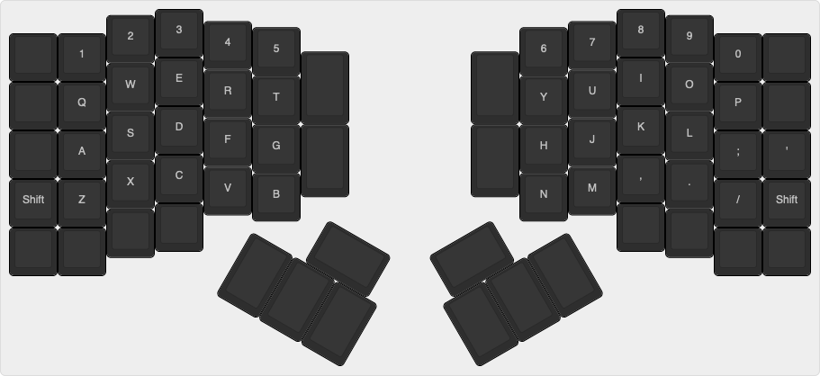
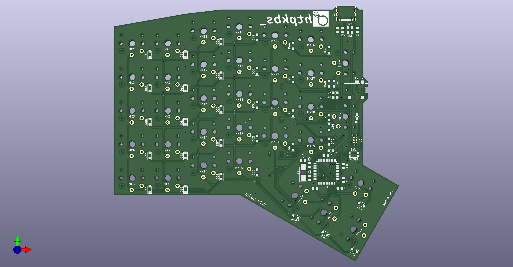
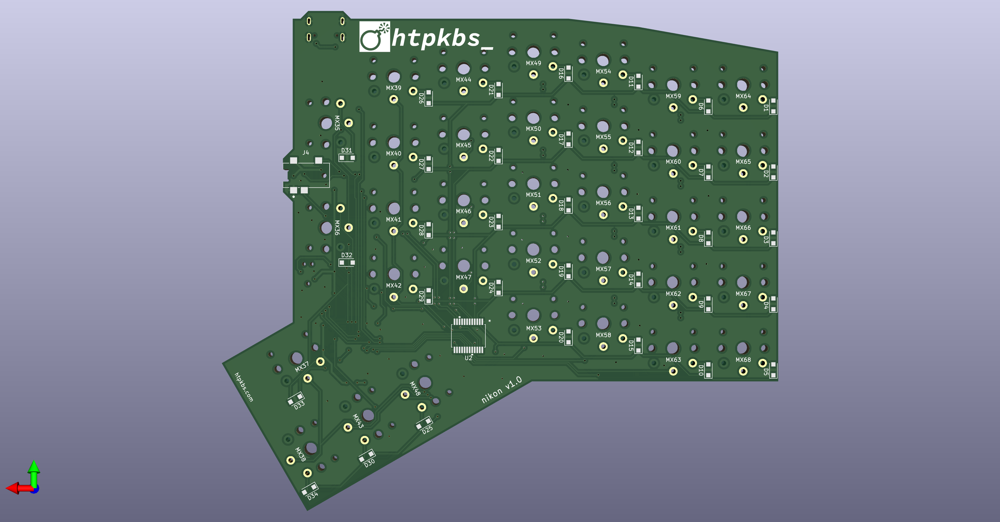

# Overview

The nikon is a keyboard PCB.

It has:

* A column-staggered, ortholinear layout
* Low profile Kailh Choc switch spacing
* A split design
* Thumb key clusters
* USB-C
* Symmetry (the same PCB can be used for both left and right halves)

# v1.0 Notes

Capacitors `C1` and `C4` are mislabeled! The silkscreen labels are swapped.

# Key Layout

The key layout looks like this:



This is the raw data that can be pasted into [Keyboard Layout Editor](http://www.keyboard-layout-editor.com/):

```
[{x:3,c:"#2e2e2e",t:"#9c9c9c",a:7},"3",{x:8.5},"8"],
[{y:-0.875,x:2},"2",{x:10.5},"9"],
[{y:-0.875,x:4},"4",{x:6.5},"7"],
[{y:-0.875,x:5},"5",{x:4.5},"6"],
[{y:-0.875},"","1",{x:12.5},"0",""],
[{y:-0.625,x:6,h:1.5},"",{x:2.5,h:1.5},""],
[{y:-0.875,x:3},"E",{x:8.5},"I"],
[{y:-0.875,x:2},"W",{x:10.5},"O"],
[{y:-0.875,x:4},"R",{x:6.5},"U"],
[{y:-0.875,x:5},"T",{x:4.5},"Y"],
[{y:-0.875},"","Q",{x:12.5},"P",""],
[{y:-0.5,x:3},"D",{x:8.5},"K"],
[{y:-0.875,x:2},"S",{x:10.5},"L"],
[{y:-0.875,x:4},"F",{x:6.5},"J"],
[{y:-0.875,x:5},"G",{h:1.5},"",{x:2.5,h:1.5},"","H"],
[{y:-0.875},"","A",{x:12.5},";","'"],
[{y:-0.5,x:3},"C",{x:8.5},","],
[{y:-0.875,x:2},"X",{x:10.5},"."],
[{y:-0.875,x:4},"V",{x:6.5},"M"],
[{y:-0.875,x:5},"B",{x:4.5},"N"],
[{y:-0.875},"Shift","Z",{x:12.5},"/","Shift"],
[{y:-0.375,x:2},"",{x:10.5},""],
[{y:-0.625},"","",{x:12.5},"",""],
[{rx:7.5,ry:4,x:-4.5},""],
[{rx:9,x:3.5},""],
[{r:30,rx:7.5,y:0.75,x:-0.625,w:1.5},""],
[{x:-1.875,h:1.5},"",{h:1.5},"",{h:1.5},""],
[{r:-30,rx:9,y:0.75,x:-0.875,w:1.5},""],
[{x:-1.125,h:1.5},"",{h:1.5},"",{h:1.5},""]
```

# PCB Renders





# Case

Files are in the `case` directory.

# Schematic

[There is a PDF of the schematic here](assets/schematic.pdf).

# AVR Programming

To-do.

## QMK

The nikon uses a port expander (the ATmega MCP23018), similar to the ErgoDox. The firmware will likely be copied from the [Pterodactyl keyboard](https://github.com/qmk/qmk_firmware/tree/master/keyboards/handwired/pterodactyl) since that seems to be the most recent keyboard with a custom `matrix.c` and support for a port expander. Eventually hopefully there will be a [generalized matrix.c for keyboards that use I/O expanders](https://github.com/qmk/qmk_firmware/issues/2065).

# Sublicenses

* The Kailh Choc switch footprints are from the [keyswitch-kicad-libary repository](https://github.com/perigoso/keyswitch-kicad-library). [The CC BY 4.0 license is included here](LICENSE.keyswitch-kicad-library).
* The keyswitch symbols are modified versions from the [MX_Alps_Hybrid repository](https://github.com/ai03-2725/MX_Alps_Hybrid). [The MIT license is included here](LICENSE.MX_Alps_Hybrid).
* The TRRS jack symbol and footprint are not licensed by CUI Devices and are free to use.
* The USB jack symbol and footprint are from SnapEDA (linked from the GCT website) and do not appear to be licensed by GCT.
* The MCP23018 symbol and footprint are from Microchip and are subject to the Ultra Library terms and conditions, which state, "You may incorporate the CONTENT that you are authorized to access into your products or designs which may be distributed without restriction, including for commercial, educational, and open-source purposes."
